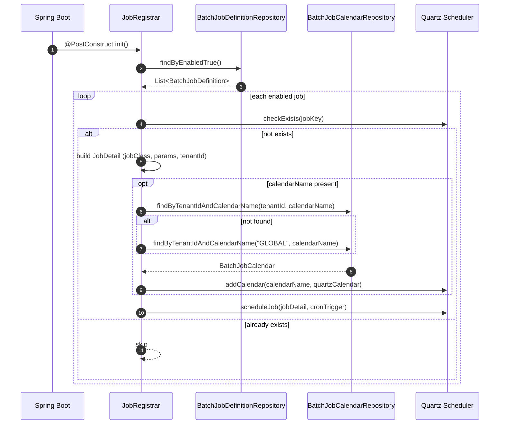
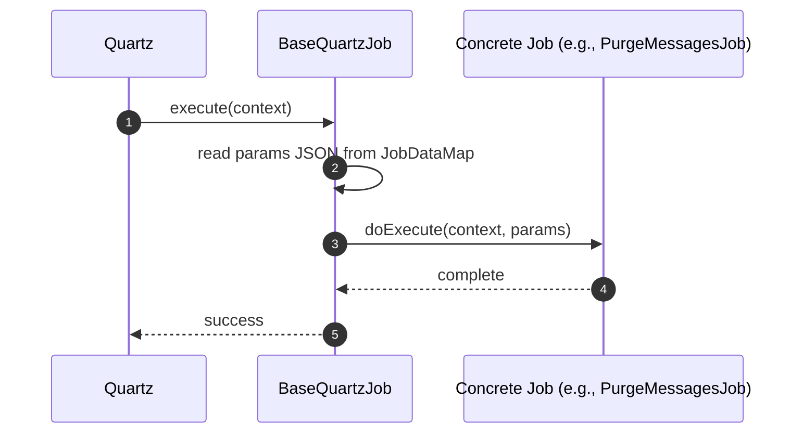
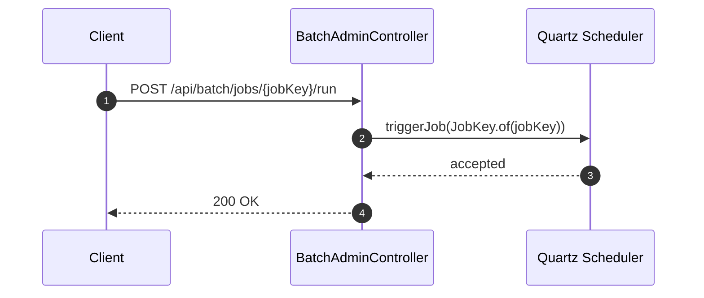
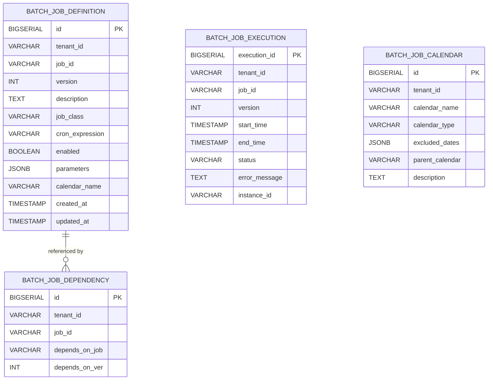

# Batch Scheduler Service (Spring Boot + Quartz)

A Spring Boot service that registers and runs **Quartz** jobs from **database-driven job definitions**. Jobs are **versioned**, **multi-tenant** aware, and can be constrained by Quartz **Calendars** (e.g., holiday exclusions).

> Project root: `batch-service/` (Gradle)

---

## Tech stack

- Java 19, Spring Boot 3.3
- Quartz (scheduler)
- Spring Web (Admin API)
- Spring Security (Basic Auth)
- Spring Data JPA
- Liquibase (schema + seed data)
- PostgreSQL (default) 

## High-level architecture

- **Job definitions** live in `batch_job_definition` (tenant, jobId, version, class, cron, params, calendar).
- **Calendars** live in `batch_job_calendar` and are applied to triggers to *exclude* times/dates.
- On startup, `JobRegistrar` loads enabled jobs and schedules them with Quartz.
- An admin endpoint can trigger a job immediately.

### Key classes

| Area | Class | Notes |
|---|---|---|
| App entrypoint | `BatchApplication` | Spring Boot main |
| Scheduling | `JobRegistrar` | Registers jobs from DB at startup (`@PostConstruct`) |
| Jobs | `BaseQuartzJob` | Common execute wrapper + JSON params parsing |
| Example jobs | `PurgeMessagesJob`, `LedgerEtlJob` | Sample job implementations |
| Admin API | `BatchAdminController` | `POST /api/batch/jobs/{jobKey}/run` |
| Security | `SecurityConfig` | In-memory Basic Auth user for testing |

---

## How jobs are registered

At startup, the service loads enabled jobs and schedules each job with a **CronTrigger**:

1. Build a unique Quartz `JobKey` from `tenantId`, `jobId`, and `version`:
   - `tenantId:jobId-v{version}`
2. Create a `JobDetail` referencing the class name stored in the DB (`job_class`).
3. Attach job parameters (`params`) and `tenantId` to the JobDataMap.
4. Create a CronTrigger using `cron_expression`.
5. If `calendar_name` is set, load a calendar (tenant-specific, fallback global) and apply it to the trigger.

---

## Sequence diagrams

### 1) Startup registration



### 2) Cron-triggered execution



### 3) Admin-triggered run-now



---

## Database schema

Liquibase loads schema from `src/main/resources/db/changelog/schema.sql`.

### ER diagram



### Notes

- `batch_job_definition` has a unique constraint on `(tenant_id, job_id, version)`.
- `batch_job_dependency` enforces a foreign key `(tenant_id, depends_on_job, depends_on_ver)` -> `batch_job_definition(tenant_id, job_id, version)`.
- `batch_job_execution` is present in the schema but not yet wired to job execution listeners in code.

---

## Configuration

### application.yaml (PostgreSQL default)

```yaml
spring:
  datasource:
    url: jdbc:postgresql://localhost:5432/testdb
    username: postgres
    password: postgres
    driver-class-name: org.postgresql.Driver

  jpa:
    hibernate:
      ddl-auto: none
    show-sql: true

  liquibase:
    change-log: classpath:db/changelog/db.changelog-master.yml
    enabled: true
```

### Running Postgres locally

```bash
docker run --name batch-postgres \
  -e POSTGRES_DB=testdb \
  -e POSTGRES_USER=postgres \
  -e POSTGRES_PASSWORD=postgres \
  -p 5432:5432 \
  -d postgres:16
```

---

## Build & run

```bash
cd batch-service
./gradlew clean test
./gradlew bootRun
```

Service will start on the default Spring Boot port (8080) unless overridden.

---

## Admin API

### Trigger a job immediately

- Endpoint: `POST /api/batch/jobs/{jobKey}/run`
- Auth: Basic Auth (default in-memory user)
  - username: `admin`
  - password: `admin123`

Example:

```bash
curl -u admin:admin123 -X POST \
  http://localhost:8080/api/batch/jobs/tenant1:purge_messages-v1/run
```

> `jobKey` must match the key format used by `JobRegistrar`: `tenantId:jobId-v{version}`.

---

## Job parameters

Job parameters are stored in `batch_job_definition.parameters` (JSONB). At runtime:

- `JobRegistrar` stores the JSON string into the Quartz JobDataMap under key `params`.
- `BaseQuartzJob` reads it and deserializes it into `Map<String, Object>`.

Example `parameters` JSON:

```json
{"retentionDays": 30}
```

In `PurgeMessagesJob`:

```java
int retentionDays = (int) params.getOrDefault("retentionDays", 30);
```

---

## Quartz calendars

Quartz calendars let you **exclude** certain times from firing, without changing the Cron expression.

This project currently builds an **AnnualCalendar** based on `batch_job_calendar.excluded_dates` (list of `YYYY-MM-DD` strings), and attaches it to a job's trigger.

### Important behavior in this codebase

- Calendar lookup is tenant-first, then global fallback.
- Global fallback currently searches for `tenantId = "GLOBAL"`.
  - Seed data inserts `tenant_id = 'global'` (lowercase). If you want fallback to work out-of-the-box, align the casing in either the code or the data.

### Calendar types (cheat sheet + examples)

Below are common Quartz calendar types and when to use them. You can extend `JobRegistrar#buildQuartzCalendar` to support these based on `calendar_type`.

#### 1) AnnualCalendar (exclude specific days each year)

Use: holidays like Jan 1, Jul 4, Dec 25.

```java
AnnualCalendar cal = new AnnualCalendar();
java.util.Calendar d = java.util.Calendar.getInstance();
d.set(java.util.Calendar.MONTH, java.util.Calendar.JANUARY);
d.set(java.util.Calendar.DAY_OF_MONTH, 1);
cal.setDayExcluded(d, true);
```

#### 2) HolidayCalendar (exclude full dates)

Use: exclude a list of one-off dates (not repeating annually).

```java
HolidayCalendar cal = new HolidayCalendar();
cal.addExcludedDate(java.sql.Date.valueOf("2026-11-26"));
```

#### 3) WeeklyCalendar (exclude days of the week)

Use: prevent weekend firing.

```java
WeeklyCalendar cal = new WeeklyCalendar();
cal.setDayExcluded(java.util.Calendar.SATURDAY, true);
cal.setDayExcluded(java.util.Calendar.SUNDAY, true);
```

#### 4) DailyCalendar (allow only certain hours each day)

Use: business hours windows.

```java
// Only allow triggers between 09:00 and 17:00
auto cal = new DailyCalendar("09:00", "17:00");
cal.setInvertTimeRange(false);
```

> Tip: set `invertTimeRange(true)` to *exclude* the range instead.

#### 5) MonthlyCalendar (exclude specific days of month)

Use: e.g., do not run on the 1st day of each month.

```java
MonthlyCalendar cal = new MonthlyCalendar();
cal.setDayExcluded(1, true);
```

#### 6) CronCalendar (exclude times based on another cron)

Use: exclude complex windows, e.g., “don’t run during the first 10 minutes of every hour”.

```java
CronCalendar cal = new CronCalendar("0 0-9 * * * ?");
```

#### 7) BaseCalendar (wrap another calendar)

Use: hierarchical calendars (parent-child), which maps well to `parent_calendar`.

```java
HolidayCalendar parent = new HolidayCalendar();
parent.addExcludedDate(java.sql.Date.valueOf("2026-12-25"));

BaseCalendar child = new BaseCalendar(parent);
// child can further exclude or include, depending on implementation
```

---

## Seed data

Liquibase includes `sample-data.sql` which inserts:

- Calendars:
  - `global-holidays`
  - `tenant1-holidays` (parent: `global-holidays`)
  - `tenant1-business-hours`
- Jobs:
  - `purge_messages` -> `PurgeMessagesJob` (2AM daily)
  - `ledger_etl` -> `LedgerEtlJob` (1:30AM daily)

---

## Quartz persistence (optional)

By default, Spring Boot can run Quartz with an in-memory job store. If you want Quartz to persist its own triggers/jobs (and enable clustering), configure:

```yaml
spring:
  quartz:
    job-store-type: jdbc
    jdbc:
      initialize-schema: always   # or never if you manage schema yourself
    properties:
      org.quartz.scheduler.instanceId: AUTO
      org.quartz.jobStore.isClustered: true
```

If you use DB2, you will also need the appropriate Quartz delegate, as hinted in the commented `application.yaml`.

---

## Extending the service

### Add a new job

1. Create a class extending `BaseQuartzJob` and implement `doExecute`.
2. Insert a row into `batch_job_definition` with:
   - `job_class` = fully qualified class name
   - `cron_expression` = Quartz cron
   - `parameters` = JSON
   - `enabled` = true

### Support more calendar types

- Enhance `JobRegistrar#buildQuartzCalendar` to switch on `BatchJobCalendar.calendarType`.
- Consider implementing parent chaining using `parentCalendar` (e.g., build parent first, wrap with `BaseCalendar`).

---

## Troubleshooting

- **Job not firing**: verify your cron expression (Quartz format) and confirm no Calendar is excluding the fire times.
- **Calendar fallback not working**: align `GLOBAL` vs `global` tenant id between seed data and `JobRegistrar#findCalendar`.
- **Trigger now 404/401**: Basic Auth is enabled for `/api/batch/**`.

